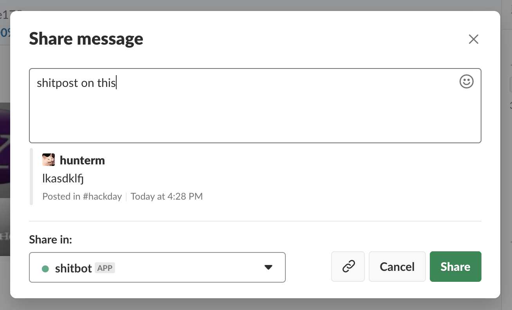

# Shitbot
## A simple bot for shitposting
| [Quickstart](#quickstart) | [Matchers](#matcher) | [Handlers](#handler) | [Message](#message) | [Advanced](#advanced) |
| --- | --- | --- | --- | --- |

In reality it's a bot that just tries to make it really fast and easy to respond to messages
that are sent.

Right now it's mainly for handling messages live as they come in. You can see a bunch of
contrived examples in [`src/_testbot.ts`](./src/_testbot.ts).

## Quickstart

First install:
| `npm install shitbot` |  `yarn add shitbot`
| --- | --- |

The most basic responder probably looks like this

```js
import { Shitbot, all } from 'shitbot'
const bot = new Shitbot(token)

bot.handle(
  // Only if they do: `@bot hi` or `/msg @bot hi`
  all.directedAtBot.contains('hi'),
  msg => `hi to you too ${msg.userName} 🤘`,
)
```

The first argument is the "matcher" and the second argument is the "handler".

The matcher filters the messages so you only respond to applicable messages, the handler
dictates how to respond to the message.

### Matcher
Responders have a matcher, that filters what messages it'll respond to. They are a builder
pattern that you can add more filters.

- `all` - matches all messages, must be the seed for all matchers
- `startsWith('string')` - only matches messages that start with the supplied string, provides
  everything after the prefix to the handler as an argument
- `contains('string')` - matches any message that has the supplied string anywhre in it
- `matches(/^prefix: (.+)/i)` - matches to a regex, any capture groups are then passed along
to the handler
- `messageIs('string')` - only matches if the whole message is only the supplied string (not counting
  mentions at beginning of string)
- `directedAtBot` - only match if the user `@mentions` the bot or if they IM the bot
- `mentionsBot` - matches only if the message starts with `@shitbot` (or whatever the bot is named)
- `isIM` - only matches if message is sent via an IM to the bot
- `inChannels('new_york', 'random')` - matches any of supplied channels

You can, and should, chain these to combine matchers like this:

```js
all.isIM.startsWith('foo')
```

Matchers are defined in [`src/matcher.ts`](./src/matcher.ts).

#### Logic Matchers
There are some matchers for doing more complex logic if you want

- `or(all.inChannel('random'), all.isIM)`
- `and(all.inChannel('random'), all.startsWith('hi'))` - mostly included for completeness, should probably just use normal chaining for and
- `not(all.isIM)`

### Handler
The second part of responding is the handler, this is a function that is called iff the matcher
succeeds.

Handlers are just functions that take in a message and return a response, in their simplest form

```js
(msg) => `echo ${msg.text}`
```

#### Message
The message supplies the following pieces of information
- `msg.text` - the body of the message, if you `@shitbot` it will automatically remove that from the text
- `msg.userName` - the user that sent the message
- `msg.channelName` - the channel name that the message was posted in
- `msg.conversationId` - the id of the channel the message was sent in
- `msg.isIM` - if the message is an IM
- `msg.userId` - the user id of the sender

### Handler Result
The handler can return a string, that's a quick alias for just replying in the same channel that the original
message was sent.

Otherwise you can have the handler respond using methods on the message itself.

- `msg.reply('text')` - Same as plain text, replies in whatever cahnnel.
- `msg.ephemoralResponse('message')` - Sends the message to the person who wrote the original message, only
that author can see this.
- `msg.replyThread('message')` - replies but in a new thread on the existing message
- `msg.emojiWordReaction('word')` - Adds emoji reaction that spells out the supplied word
- `msg.emojiReaction('emoji1','emoji2'...)` - Adds any emoji reactions to the message that was sent

### Attachments & Blocks
You can add richer content to your responses with Attachments (deprecated) and [Blocks](https://api.slack.com/block-kit).

This is easy, for `reply`, `replyThread`, and `ephemoralResponse` you can just include them instead of the text:

```js
bot.handle(
  all.isIM,
  msg => {
    const blocks = [
      	{
          "type": "section",
          "text": {
            "type": "mrkdwn",
            "text": "You can add an image next to text in this block."
          },
          "accessory": {
            "type": "image",
            "image_url": "https://api.slack.com/img/blocks/bkb_template_images/plants.png",
            "alt_text": "plants"
          }
        }
    ]

    return msg.reply({ blocks })
  }
)
```

## Advanced
### Acting on others messages
If someone posts something that you want to act on you can have the bot act on that fairly magically.
If you send the bot a link to a message with content in that body, the content provided will act on the
shared post rather than the IM itself. Share it like this:


## TODO
- [ ] Allow sending attachments
- [ ] Add ability to send messages without replying
- [ ] Add scheduling to sending messages
- [ ] Add web UI for adding rules (pie in the sky)
